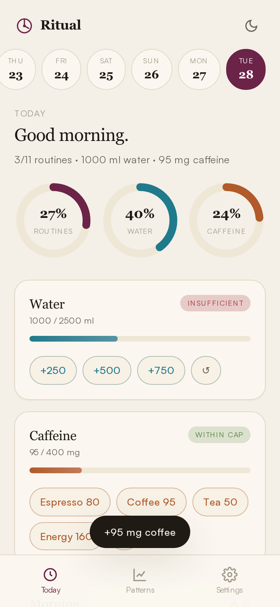

# Ritual — Daily Tracker App

A free, installable, offline-first habit tracker. Built as inspiration / replacement for paid trackers like Harvee.

🔗 **Live:** [habittracker.pplx.app](https://habittracker.pplx.app)



## What it tracks

- **Daily morning routine** — sunscreen, hair serum, vitamins, biotin, collagen, daily photo (fully editable)
- **Daily evening routine** — skincare, minoxidil, scalp massage, eye patches, eye massage (fully editable)
- **Water log** — quick-add 250 / 500 / 750 ml chips with undo, target progress, status badge
- **Caffeine log** — Espresso 80, Coffee 95, Tea 50, Energy 160 mg presets with undo and daily cap
- **Workout** — Trained / Rest toggle with optional note
- **Body metrics** — sleep hours, resting heart rate, HRV, stress (manual entry)
- **Daily photo** — snap or upload, auto-downscaled to 800px JPEG
- **Weekly habits** — e.g. hair oiling × 2, microneedle head × 1 (configurable target counts)
- **Monthly habits** — e.g. microneedle face × 1
- **Streaks** — automatic streak counters for morning + evening routines
- **Date strip** — 14-day scroller, tap to backfill or review any day

## Patterns view

- 14-day routine adherence (bar chart)
- 14-day hydration & caffeine (dual-axis line chart)
- Sleep vs. caffeine scatter with Pearson correlation
- 28-day workout/rest strip

## Tech

Vanilla HTML, CSS, and JavaScript — no framework, no build step.

- **Storage:** `localStorage` (per device, no account)
- **Charts:** [Chart.js 4](https://www.chartjs.org/) via CDN
- **Fonts:** Fraunces (display) + Satoshi (body) via [Fontshare](https://www.fontshare.com/)
- **PWA:** Installable on iOS/Android home screen, works offline via service worker
- **Themes:** Light + dark, follows system preference, manual toggle

## Project structure

```
.
├── index.html              # App shell + all view markup
├── style.css               # Design tokens + components (light/dark)
├── app.js                  # State, render, charts, PWA wiring
├── sw.js                   # Service worker (offline cache)
├── manifest.webmanifest    # PWA manifest
├── icon.svg                # Source logo
└── icons/
    ├── icon-192.png
    ├── icon-512.png
    └── icon-maskable-512.png
```

## Run locally

No build, no install. Just serve the folder over HTTP:

```bash
python3 -m http.server 5000
# open http://localhost:5000
```

A real HTTP server is required (not `file://`) because service workers and the manifest need an origin.

## Install on iPhone

1. Open the [live URL](https://habittracker.pplx.app) in **Safari** (iOS only allows install from Safari)
2. Tap the Share button
3. **Add to Home Screen**

The app launches full-screen, works offline, and survives device restarts.

## Data backup

All your data lives only in your browser's local storage. To back it up or move it to another device:

1. Open **Settings**
2. **Export JSON** — saves a `ritual-backup-YYYY-MM-DD.json` file
3. On the other device, **Import JSON**

`Reset all` wipes everything if you want to start fresh.

## License

MIT
